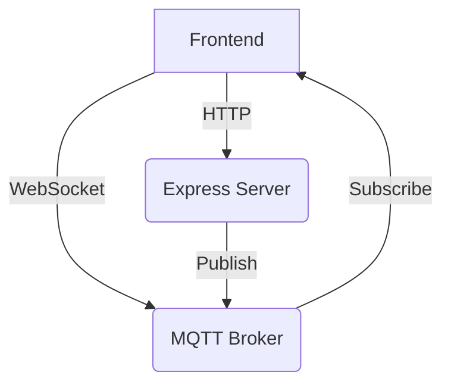

# Real-time Update Proof of Concept

## Overview

This project demonstrates a simple real-time update system using MQTT for messaging and Express for HTTP requests.

## Setup

1. Install Docker and Docker Compose [tutorial](https://docs.docker.com/engine/install/)
2. Clone this repository `git clone https://github.com/theisaaclloyd/mqtt-rapid-updates.git`
3. Run `docker compose up -d --build` in the project root
4. Navigate to the `http://localhost:3000` directory

## Usage

1. Open the app in multiple browser windows
2. Enter a message and click "Send" in any window
3. Observe the message appearing in all windows in real-time

## Technologies

- Backend: Node.js, Express, MQTT
- Frontend: React
- Infrastructure: Docker, Mosquitto MQTT Broker

## License

MIT
