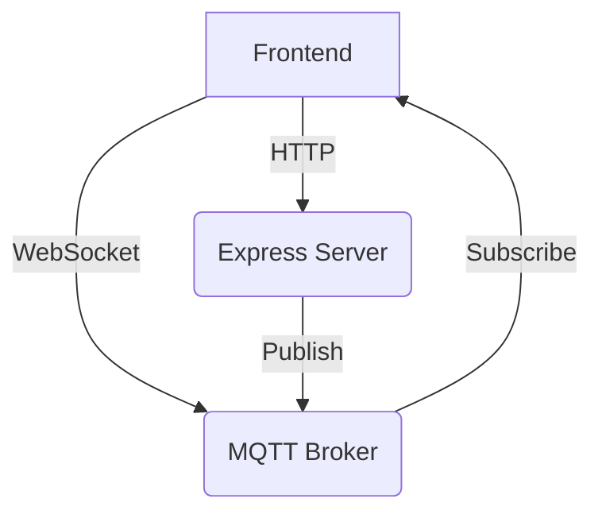

# Real-time Update Proof of Concept

## Overview

This project demonstrates a simple real-time update system using MQTT for messaging and Express for HTTP requests.

## Setup

1. Install Docker and Docker Compose
2. Clone this repository
3. Run `docker-compose up --build` in the project root
4. Navigate to the `frontend` directory
5. Run `npm install`
6. Run `npm start`

## Usage

1. Open the app in multiple browser windows
2. Enter a message and click "Send" in any window
3. Observe the message appearing in all windows in real-time

## Technologies

- Backend: Node.js, Express, MQTT
- Frontend: React
- Infrastructure: Docker, Mosquitto MQTT Broker

## License

MIT
